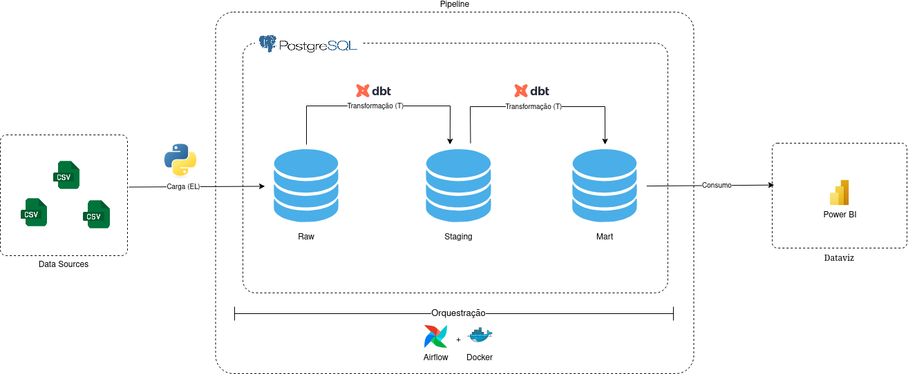

# 🛒 Olist Data Engineering Project

Este projeto implementa um pipeline completo de engenharia de dados utilizando o dataset público da Olist, um e-commerce brasileiro. O objetivo é construir um fluxo de ingestão, transformação e disponibilização de dados, seguindo boas práticas de modelagem e orquestração, para auxiliar nas análises de negócio.

## 🏗️ Arquitetura do Pipeline de Dados

  

  Diagrama da arquitetura mostrando ingestão, transformação e consumo dos dados.

O pipeline implementa um fluxo completo de engenharia de dados, desde a ingestão até a camada de análise:

- **Fonte de Dados:** Foi utilizado o dataset público da empresa de e-commerce brasileira Olist, disponível no Kaggle: [Brazilian E-Commerce Public Dataset by Olist](https://www.kaggle.com/datasets/olistbr/brazilian-ecommerce).
- **Ingestão e Orquestração:** O Apache Airflow executa DAGs responsáveis por extrair os dados do dataset Olist (em formato CSV) e carregá-los no PostgreSQL (camada raw).
- **Transformação:** O dbt organiza os dados em camadas (staging e marts), aplicando modelagem analítica.
- **Infraestrutura:** Todo o ambiente é conteinerizado com Docker Compose.
- **Consumo:** Os dados transformados são utilizados no Power BI para criação de dashboards analíticos.

# 🛠️ Ferramentas Usadas

- **Apache Airflow:** Orquestração do pipeline por meio de DAGs.
- **PostgreSQL:** Armazenamento dos dados nas camadas raw e analítica.
- **dbt:** Transformação e modelagem dos dados em camadas (staging e marts).
- **Docker Compose:** Conteinerização e gerenciamento do ambiente.
- **Power BI:** Visualização dos dados por meio de dashboards analíticos.